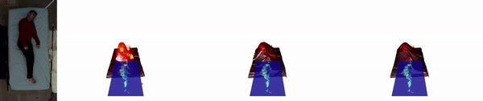
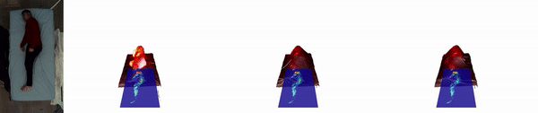
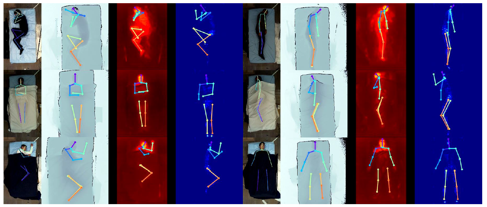
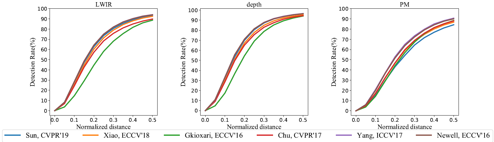

#  SLP datasets 
Simultaneously-collected multimodal Lying Pose (SLP) provide a large-scale highly diverse pose images for in-bed human pose/behavior monitoring studies. 
Multiple modalities are collected simultaneously including RGB, long wave infrared (LWIR), depth and pressure map (PM), which covers any main stream modalities that have been employed in the relevant studies, so far. Multiple cover conditions including uncover, cover 1 (thin cover) and cover2 (thick cover) are also included. For dataset details and access request, please visit [SLP page at ACLab website](https://ostadabbas.sites.northeastern.edu/slp-dataset-for-multimodal-in-bed-pose-estimation-3/). 







This repo provides the working examples to illustrate SLP usage in:
1. Potential usage in future machine learning studies.  
2. Visualization to study the correspondence between modalities. 
3. Working example for 2D human pose estimation. 

by providing the code examples:
  
1. `eg_SLP_interface.ipynb`: a tutorial on SLP dataset interface. SLP provide flexible data interface to feed data with varying requirements including different modalities, alignment between modalities, different cover conditions, and multimodal data for collaboration with 2D pose labels. Our SLP interface provides a basic tools for data feeding in potential future studies.  

2. `eg_vis_SLP.ipynb`: a tutorial for LWIR-D-PM visualization. To understand how in-bed (i.e. at-rest) human pose affects the underlying pressure is also an interesting topic to explore the underlying causes associated with many bed-bound diseases. This tutorial shows how to visualize our dataset samples with an interactive camera control provided in jupyter notebook.
    
3. `main.py`: a working example of 2D human pose estimation with multiple candidate models provided. 

## dependencies 
This work is developed with pytorch1.4.0, CUDA10.0. Some dependencies are for visualization purpose such as visdom and plotly. 
```
scipy
matplotlib
opencv  
torch
torchvision 
scikit-image
visdom
json
plotly
jsonpatch (visdom patch)
dominate 
tqdm
configargparse
yacs
jupyter
```
## Setup 
1. Down SLP dataset from [SLP page at ACLab website](https://web.northeastern.edu/ostadabbas/2019/06/27/multimodal-in-bed-pose-estimation/), unzip.
2. point `opt.ds_fd` to the path where SLP is kept.
3. point `opt.output_dir` to where you want to keep all results  (default:`./output`)

Options default can be changed in `opt.py` or through arguments `--arg_name`. Following instruction will be based on default setting `./output`. 

## To use
For 2D human pose estimation. For training: 

`python main.py --modelConf config/[modelName].conf`

For testing, testing will be conduted automatically after training. 

`python main.py --modelConf config/[modelName].conf --if_test`

For each model, we provides the training scripts in `script` which is compatible for sh or slurm. Please choose the env and node setting according to your local environment.  

Candidate models:  
* StackedHourGlass: [Stacked Hourglass Networks for
Human Pose Estimation](https://arxiv.org/pdf/1603.06937.pdf)
* ChainedPredictions: [Chained Predictions Using Convolutional Neural
Networks](https://arxiv.org/pdf/1605.02346.pdf)
* PoseAttention: [Multi-Context Attention for Human Pose Estimation (Pose-Attention)](https://arxiv.org/pdf/1702.07432.pdf) 
* PyraNet: [Learning Feature Pyramids for Human Pose Estimation (PyraNet)](https://arxiv.org/pdf/1708.01101.pdf)
* HRpose: [Deep High-Resolution Representation Learning for Human Pose Estimation](https://arxiv.org/pdf/1902.09212.pdf)
* RESpose: [Simple Baselines for Human Pose Estimation and Tracking](https://arxiv.org/pdf/1804.06208.pdf)

Other options: 
```
--mod_src: the input modalies
--cov_li: the cover list [uncover|cover1|cover2]. Default use all covers
--SLP_set: [danaLab|simLab]. The SLP splite.
    danaLab for main set in home setting. 
    simLab for a real hospital room. Only for test purpose. 
```



## File structure
In each experiment,  one specific experiment folder will be created.  The model weights file (.pth) will be saved in `model_dump` subfolder. Visualization will be saved in `vis`. The test result will be saved in `result` in json format. 
```
[exp name]	
|-- module_dump:save model weights 
|-- log:	record training loss and test loss  separately, we can only check test 
|-- result:     test result of the metrics, predictions (json, npy) 
|-- vis:	the visualization result 
|   |   |--division[test|train]/	
|   |   |   |--[testSetName]
|   |   |   |   |--2d
|   |   |   |   |--...
|--web: 
```

## SLP Model Zoo 
For who already has the corresponding modality device for patient monitoring or want to run inference directly, the pretrained models are provided here.

|model | modality | 
|:---:| :---:|
|StackedHourGlass:|  [LWIR](http://www.coe.neu.edu/Research/AClab/SLP/models_2d/SLP_IR_u12_StackedHourGlass_exp.zip),  [depth](http://www.coe.neu.edu/Research/AClab/SLP/models_2d/SLP_depth_u12_StackedHourGlass_exp.zip),  [PM](http://www.coe.neu.edu/Research/AClab/SLP/models_2d/SLP_PM_u12_StackedHourGlass_exp.zip)|
 |ChainedPredictions: | [LWIR](http://www.coe.neu.edu/Research/AClab/SLP/models_2d/SLP_IR_u12_ChainedPredictions_exp.zip),  [depth](http://www.coe.neu.edu/Research/AClab/SLP/models_2d/SLP_depth_u12_ChainedPredictions_exp.zip),  [PM](http://www.coe.neu.edu/Research/AClab/SLP/models_2d/SLP_PM_u12_ChainedPredictions_exp.zip) |
 | PoseAttention: |  [LWIR](http://www.coe.neu.edu/Research/AClab/SLP/models_2d/SLP_IR_u12_PoseAttention_exp.zip),  [depth](http://www.coe.neu.edu/Research/AClab/SLP/models_2d/SLP_depth_u12_PoseAttention_exp.zip),  [PM](http://www.coe.neu.edu/Research/AClab/SLP/models_2d/SLP_PM_u12_PoseAttention_exp.zip)|
 | PyraNet: |  [LWIR](http://www.coe.neu.edu/Research/AClab/SLP/models_2d/SLP_IR_u12_PyraNet_exp.zip),  [depth](http://www.coe.neu.edu/Research/AClab/SLP/models_2d/SLP_depth_u12_PyraNet_exp.zip),  [PM](http://www.coe.neu.edu/Research/AClab/SLP/models_2d/SLP_PM_u12_PyraNet_exp.zip)|
 | HRpose:|  [LWIR](http://www.coe.neu.edu/Research/AClab/SLP/models_2d/SLP_IR_u12_HRpose_exp.zip),   [depth](http://www.coe.neu.edu/Research/AClab/SLP/models_2d/SLP_depth_u12_HRpose_exp.zip),  [PM](http://www.coe.neu.edu/Research/AClab/SLP/models_2d/SLP_PM_u12_HRpose_exp.zip),  [PM+depth](http://www.coe.neu.edu/Research/AClab/SLP/models_2d/SLP_PM-depth_u12_HRpose_exp.zip),  [PM+LWIR](http://www.coe.neu.edu/Research/AClab/SLP/models_2d/SLP_PM-IR_u12_HRpose_exp.zip),  [LWIR+depth](http://www.coe.neu.edu/Research/AClab/SLP/models_2d/SLP_IR-depth_u12_HRpose_exp.zip),  [PM+LWIR+depth](http://www.coe.neu.edu/Research/AClab/SLP/models_2d/SLP_PM-depth-IR_u12_HRpose_exp.zip),
 | RESpose: | [LWIR](http://www.coe.neu.edu/Research/AClab/SLP/models_2d/SLP_IR_u12_RESpose_exp.zip),  [depth](http://www.coe.neu.edu/Research/AClab/SLP/models_2d/SLP_depth_u12_RESpose_exp.zip),  [PM](http://www.coe.neu.edu/Research/AClab/SLP/models_2d/SLP_PM_u12_RESpose_exp.zip), 
 
## Citation 
@article{liu2022simultaneously,
  title={Simultaneously-Collected Multimodal Lying Pose Dataset: Towards In-Bed Human Pose Monitoring under Adverse Vision Conditions},
  author={Liu, Shuangjun and Huang, Xiaofei and Fu, Nihang and Li, Cheng and Su, Zhongnan and Ostadabbas, Sarah},
  journal={IEEE Transactions on Pattern Analysis and Machine Intelligence (TPAMI)},
  year={2022}
}

@article{liu2019seeing,
  title={Seeing Under the Cover: A Physics Guided Learning Approach for In-Bed Pose Estimation},
  author={Liu, Shuangjun and Ostadabbas, Sarah},
  journal={22nd International Conference on Medical Image Computing and Computer Assisted Intervention (MICCAI2019), Shenzhen, China. arXiv preprint arXiv:1907.02161},
  year={2019}
}


## Acknowledgement
https://github.com/leoxiaobin/deep-high-resolution-net.pytorch

https://github.com/Naman-ntc/Pytorch-Human-Pose-Estimation

https://github.com/mks0601/3DMPPE_POSENET_RELEASE

Graduate Student R&D Team: Shuangjun Liu (team lead), and Xiaofei Huang.

Also, special thanks to the student volunteers (Zhilan Li, Zhun Deng, Cheng Li, Zhongnan Su, Fei Xue, Fei Gao, and Yu Yin) that helped us to collect and prepare the SLP dataset.

## License 
* By downloading or using the SLP Dataset, you are agreeing to the “Non-commercial Purposes” condition. “Non-commercial Purposes” means research, teaching, scientific publication and personal experimentation. Non-commercial Purposes include use of the Dataset to perform benchmarking for purposes of academic or applied research publication. Non-commercial Purposes does not include purposes primarily intended for or directed towards commercial advantage or monetary compensation, or purposes intended for or directed towards litigation, licensing, or enforcement, even in part. SLP dataset is provided as-is, is experimental in nature, and not intended for use by, with, or for the diagnosis of human subjects for incorporation into a product.

* For other uses please contact [Augmented Cognition Lab (ACLab)](http://www.northeastern.edu/ostadabbas/) at Northeastern University. 

